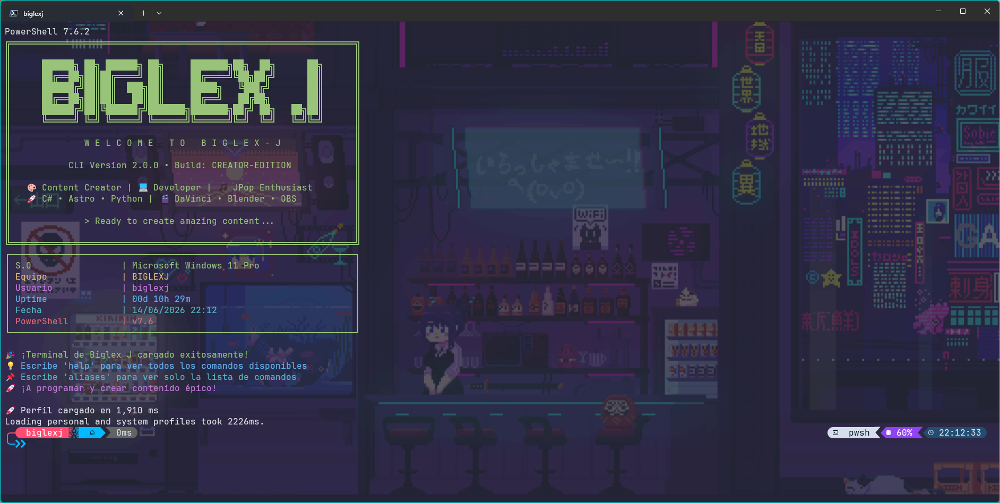

# 🚀 PowerShell $PROFILE - Biglex J Edition

Una configuración premium de PowerShell 7 diseñada para optimizar el desarrollo, la creación de contenido y la experiencia en la terminal, con una visualización y rendimiento optimizados.



---

## 📋 Requisitos

Para que este perfil funcione correctamente y muestre todos los iconos e información visual, necesitas instalar:

1. **PowerShell 7+** (Se ejecuta mediante `pwsh`).
2. **Windows Terminal** (Recomendado para hospedar la terminal).
3. **Oh My Posh** (Motor del prompt):
   ```powershell
   winget install JanDeDobbeleer.OhMyPosh
   ```
4. **Terminal-Icons** (Iconos para archivos/carpetas):
   ```powershell
   Install-Module -Name Terminal-Icons -Scope CurrentUser
   ```
5. **Nerd Font:** Necesaria para renderizar los iconos y glifos del prompt (por ejemplo, *Caskaydia Cove Nerd Font* o *Fira Code Nerd Font*). Recuerda configurar esta fuente en la apariencia de Windows Terminal.

---

## 🚀 Instalación

Tienes dos métodos para instalar este perfil. El **Método 1** es el recomendado ya que te permite tener el archivo original en tu carpeta de repositorios Git y no tener duplicados en la carpeta de Documentos.

### Método 1: Redirección mediante Dot-Sourcing (Recomendado 🌟)
Este método permite que tu perfil real de Windows cargue directamente el archivo del repositorio:

1. Abre tu perfil de PowerShell en VS Code o tu editor:
   ```powershell
   code $PROFILE
   ```
2. Reemplaza todo su contenido con la siguiente línea (ajustando la ruta a donde clonaste el repositorio):
   ```powershell
   . "D:\Proyectos\4. Temas\2. Windows\Terminal Windows\Microsoft.PowerShell_profile.ps1"
   ```
3. Guarda el archivo. ¡Listo! Cualquier modificación que hagas en el archivo de este repositorio se aplicará inmediatamente a tu terminal y estará lista para subirse a Git sin necesidad de copiar y pegar manualmente.

### Método 2: Copia Directa
Si prefieres copiar el archivo directamente:
1. Copia el archivo `Microsoft.PowerShell_profile.ps1` de este repositorio.
2. Abre tu perfil de PowerShell en tu editor:
   ```powershell
   code $PROFILE
   ```
3. Pega el contenido y guarda.

---

## ⚙️ Configuración del Tema
Asegúrate de que la variable de entorno `$env:POSH_THEMES_PATH` en el perfil apunte a la carpeta donde tienes guardados los temas `.json`.
```powershell
$env:POSH_THEMES_PATH = "D:\Proyectos\4. Temas\2. Windows\Terminal Windows\Themes"
```

El tema predeterminado cargado es `biglexj.omp.json`, el cual se encuentra dentro de la carpeta `Themes`.

---

## 🎯 Comandos y Aliases Disponibles
Para ver la lista completa de comandos rápidos, utilidades de Git, utilidades de desarrollo y herramientas de Ely Intelligence, consulta el archivo:

👉 **[Guía de Comandos y Aliases](file:///D:/Proyectos/4.%20Temas/2.%20Windows/Terminal%20Windows/commands.md)**

---

## 🔧 Solución de Problemas

### Los iconos se ven como cuadrados vacíos (□) o rotos
- **Causa:** No tienes una Nerd Font configurada en Windows Terminal.
- **Solución:** Descarga e instala tu Nerd Font preferida, luego selecciónala en la configuración de Windows Terminal (`Settings` > `Defaults` > `Appearance` > `Font face`).

### Error al cargar el script (`Execution Policy`)
- **Causa:** La directiva de ejecución predeterminada de Windows bloquea la carga de scripts locales.
- **Solución:** Abre PowerShell como **Administrador** y ejecuta:
  ```powershell
  Set-ExecutionPolicy RemoteSigned -Scope CurrentUser
  ```
